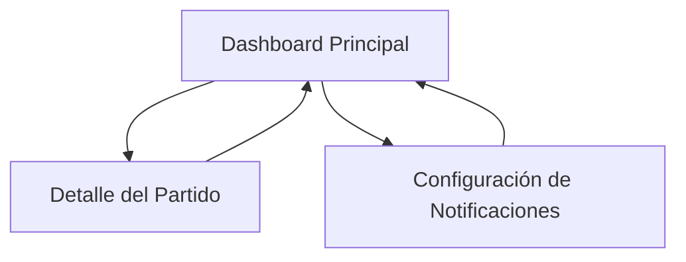

## 1. Product Overview
Aplicación web para visualizar resultados de fútbol en tiempo real durante la Copa Mundial de la FIFA 2026. Permite a los usuarios seguir partidos en vivo, ver marcadores actualizados y acceder a estadísticas detalladas de equipos y jugadores.

- Solución para aficionados al fútbol que necesitan información rápida y confiable durante el mundial
- Valor principal: Acceso inmediato a resultados y estadísticas sin recargar la página

## 2. Core Features

### 2.1 User Roles
| Role | Registration Method | Core Permissions |
|------|---------------------|------------------|
| Usuario Anónimo | Sin registro | Ver partidos, estadísticas y detalles básicos |
| Usuario Registrado | Email o OAuth | Guardar favoritos, recibir notificaciones personalizadas |

### 2.2 Feature Module
Nuestra aplicación de resultados de fútbol consiste en las siguientes páginas principales:
1. **Dashboard Principal**: Lista de partidos en vivo, filtros por torneo/estado, actualización automática de marcadores
2. **Detalle del Partido**: Estadísticas completas, alineaciones, eventos del partido (goles, tarjetas, cambios)
3. **Configuración de Notificaciones**: Gestión de equipos favoritos y preferencias de alertas

### 2.3 Page Details
| Page Name | Module Name | Feature description |
|-----------|-------------|---------------------|
| Dashboard Principal | Lista de Partidos | Mostrar partidos en tiempo real con marcadores, minutos transcurridos y estado del juego |
| Dashboard Principal | Filtros y Búsqueda | Filtrar por torneo (Mundial 2026), estado (vivo/finalizado/proximo), fecha y equipo |
| Dashboard Principal | Actualización en Vivo | Refrescar datos automáticamente cada 30 segundos sin recargar página |
| Detalle del Partido | Información General | Mostrar equipos, marcador, tiempo de juego, estadio y árbitro |
| Detalle del Partido | Estadísticas del Partido | Visualizar posesión, tiros a puerta, faltas, córners y tarjetas |
| Detalle del Partido | Eventos del Partido | Timeline con goles, tarjetas amarillas/rojas, cambios y sustituciones |
| Detalle del Partido | Alineaciones | Mostrar titulares y suplentes de ambos equipos con posiciones |
| Configuración de Notificaciones | Equipos Favoritos | Seleccionar equipos para recibir alertas de goles y finales |
| Configuración de Notificaciones | Preferencias | Configurar tipo de notificaciones (push/email) y frecuencia |

## 3. Core Process
El flujo principal de usuario comienza en el Dashboard Principal donde puede ver todos los partidos del Mundial 2026. Los usuarios pueden filtrar por estado del partido o buscar equipos específicos. Al hacer clic en un partido, acceden al Detalle del Partido con toda la información en tiempo real. Los usuarios registrados pueden acceder a la configuración para gestionar sus notificaciones favoritas.

## 4. User Interface Design

### 4.1 Design Style
- Colores primarios: Verde (#22c55e) y blanco (#ffffff) - inspirados en el césped de fútbol
- Colores secundarios: Gris oscuro (#1f2937) para texto y azul (#3b82f6) para acentos
- Botones: Estilo redondeado con sombras sutiles para profundidad
- Tipografía: Inter para títulos (24-32px) y Roboto para contenido (14-16px)
- Layout: Diseño tipo tarjetas con espaciado generoso y grid responsivo
- Iconos: Estilo outline minimalista con iconos deportivos personalizados

### 4.2 Page Design Overview
| Page Name | Module Name | UI Elements |
|-----------|-------------|-------------|
| Dashboard Principal | Lista de Partidos | Tarjetas horizontales con escudos de equipos, marcador destacado en círculo verde, tiempo de juego en badge azul |
| Dashboard Principal | Filtros | Barra sticky superior con botones segmentados para estados, selector de fecha tipo dropdown |
| Detalle del Partido | Cabecera | Fondo con gradiente verde-blanco, escudos grandes centrados, marcador en tipografía bold 48px |
| Detalle del Partido | Estadísticas | Gráfico de barras animado para posesión, badges circulares para números clave |
| Detalle del Partido | Timeline | Lista vertical con iconos de eventos, línea temporal central con puntos de colores según tipo de evento |

### 4.3 Responsiveness
Diseño desktop-first que se adapta perfectamente a tablets y móviles. En dispositivos móviles, los filtros se colapsan en un menú desplegable y las tarjetas de partidos se apilan verticalmente. Los gráficos de estadísticas se simplifican mostrando solo los datos más importantes en pantallas pequeñas.