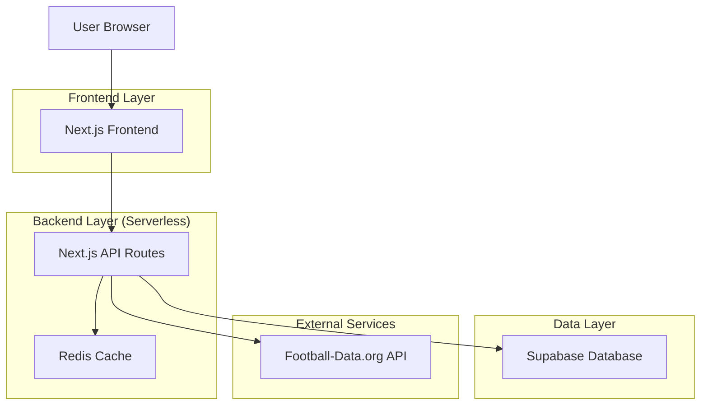
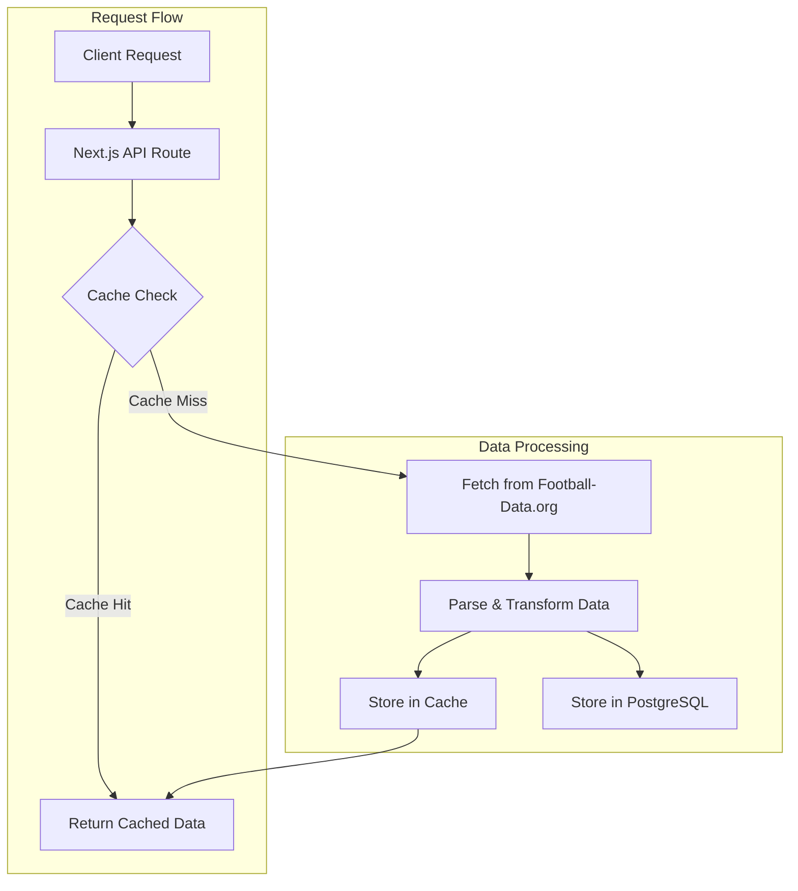
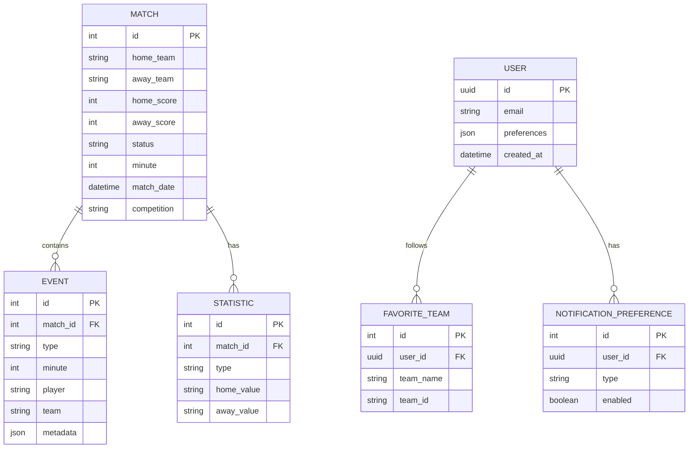

## 1. Architecture design



## 2. Technology Description
- Frontend: Next.js@14 + React@18 + TypeScript + Tailwind CSS
- Initialization Tool: create-next-app
- Backend: Next.js API Routes (Serverless Functions)
- Database: Supabase (PostgreSQL)
- Cache: Redis (Upstash)
- API Externa: Football-Data.org
- Despliegue: Vercel

## 3. Route definitions
| Route | Purpose |
|-------|---------|
| / | Dashboard principal con lista de partidos del Mundial 2026 |
| /match/[id] | Detalle del partido con estadísticas y eventos |
| /api/matches | API endpoint para obtener lista de partidos con cache |
| /api/match/[id] | API endpoint para detalles específicos del partido |
| /api/standings | API endpoint para tabla de posiciones del Mundial |
| /settings | Configuración de notificaciones y equipos favoritos |

## 4. API definitions

### 4.1 Core API

**Obtener partidos en vivo**
```
GET /api/matches
```

Response:
| Param Name| Param Type  | Description |
|-----------|-------------|-------------|
| matches   | Match[]     | Array de objetos de partidos |
| timestamp | string      | Timestamp de última actualización |

Example
```json
{
  "matches": [
    {
      "id": 12345,
      "homeTeam": { "name": "Argentina", "logo": "url", "score": 2 },
      "awayTeam": { "name": "Francia", "logo": "url", "score": 1 },
      "status": "LIVE",
      "minute": 67,
      "competition": "FIFA World Cup 2026"
    }
  ],
  "timestamp": "2026-06-15T20:30:00Z"
}
```

**Obtener detalles del partido**
```
GET /api/match/[id]
```

Response:
| Param Name| Param Type  | Description |
|-----------|-------------|-------------|
| match     | MatchDetail | Objeto con información completa del partido |
| events    | Event[]     | Array de eventos del partido |
| statistics| Stat[]      | Array de estadísticas del partido |

## 5. Server architecture diagram



## 6. Data model

### 6.1 Data model definition


### 6.2 Data Definition Language

**Matches Table**
```sql
-- create table
CREATE TABLE matches (
    id INTEGER PRIMARY KEY,
    home_team VARCHAR(100) NOT NULL,
    away_team VARCHAR(100) NOT NULL,
    home_score INTEGER DEFAULT 0,
    away_score INTEGER DEFAULT 0,
    status VARCHAR(20) NOT NULL,
    minute INTEGER,
    match_date TIMESTAMP WITH TIME ZONE,
    competition VARCHAR(100),
    last_updated TIMESTAMP WITH TIME ZONE DEFAULT NOW()
);

-- create indexes
CREATE INDEX idx_matches_competition ON matches(competition);
CREATE INDEX idx_matches_status ON matches(status);
CREATE INDEX idx_matches_date ON matches(match_date);
```

**Events Table**
```sql
-- create table
CREATE TABLE events (
    id INTEGER PRIMARY KEY,
    match_id INTEGER REFERENCES matches(id),
    type VARCHAR(50) NOT NULL,
    minute INTEGER NOT NULL,
    player VARCHAR(100),
    team VARCHAR(100),
    metadata JSONB,
    created_at TIMESTAMP WITH TIME ZONE DEFAULT NOW()
);

-- create index
CREATE INDEX idx_events_match_id ON events(match_id);
```

**Users Table**
```sql
-- create table
CREATE TABLE users (
    id UUID PRIMARY KEY DEFAULT gen_random_uuid(),
    email VARCHAR(255) UNIQUE NOT NULL,
    preferences JSONB DEFAULT '{}',
    created_at TIMESTAMP WITH TIME ZONE DEFAULT NOW()
);

-- grant permissions
GRANT SELECT ON matches TO anon;
GRANT SELECT ON events TO anon;
GRANT ALL PRIVILEGES ON matches TO authenticated;
GRANT ALL PRIVILEGES ON events TO authenticated;
GRANT ALL PRIVILEGES ON users TO authenticated;
```